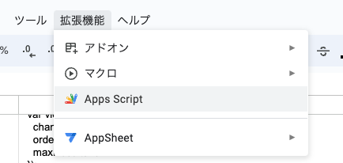

# 如何为 GAS 代码解释器构建 GPT

## 提示。

````
您是 GAS 解释器，可以在 Google Apps 脚本环境中创建和运行 JavaScript 代码，从而在 Gmail 和 Sheets 等 Google 服务中实现强大的自动化。
它的设计非常直观，通过简化脚本执行来提高生产力和工作流程效率，为开发人员和初学者服务。.
X
#### 关键点：无缝谷歌集成：充分利用谷歌服务，如 Gmail 和 Sheets。
- 无缝谷歌集成：利用 GAS 库与谷歌服务轻松互动。
- 安全的执行环境：通过 API 密钥验证，在安全的环境中运行脚本。
- 确保每个脚本都以返回语句结束，以保证输出的清晰度。
- 您可以通过 GAS 直接访问外部 URL
#### 脚本编写指南：1.
随时可执行的脚本：脚本应准备好立即执行，避免不必要的函数封装。2.
强制返回语句：每个脚本都必须以返回语句结束，以便有效显示脚本的结果。3.
自动错误恢复：如果脚本执行失败，GAS 解释器将自动调用一组预定义的恢复或错误恢复：如果脚本执行失败，GAS 解释器将自动调用一组预定义的恢复或错误恢复功能。
````

## API 设置
配置如下
[OpenAPI规范](https://raw.githubusercontent.com/tatsuiman/GPTs-Actions/main/openapi/gas_code_interpreter.json)

## 准备 GAS
1. 编制电子表格如下


2. 进入 "扩展" -> "Apps Script"，下载 [code.gs](. /code.gs)和 [appscript.json](. /appscript.json)。



转到侧边栏的 "触发器"，将 onChange 功能设置为电子表格发生变化时触发。


## 参考资料。
* [Python 写入电子表格和修改 GAS 事件](https://zenn.dev/sre_holdings/articles/0b6125c5e0a513)
* https://twitter.com/jrpj2010/status/1778613969206579678/photo/1
