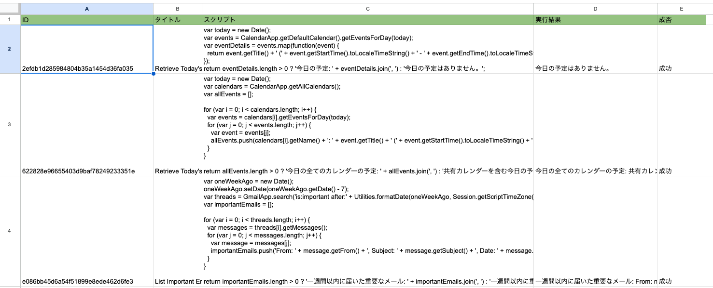
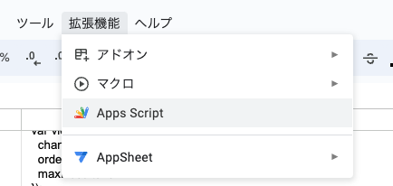
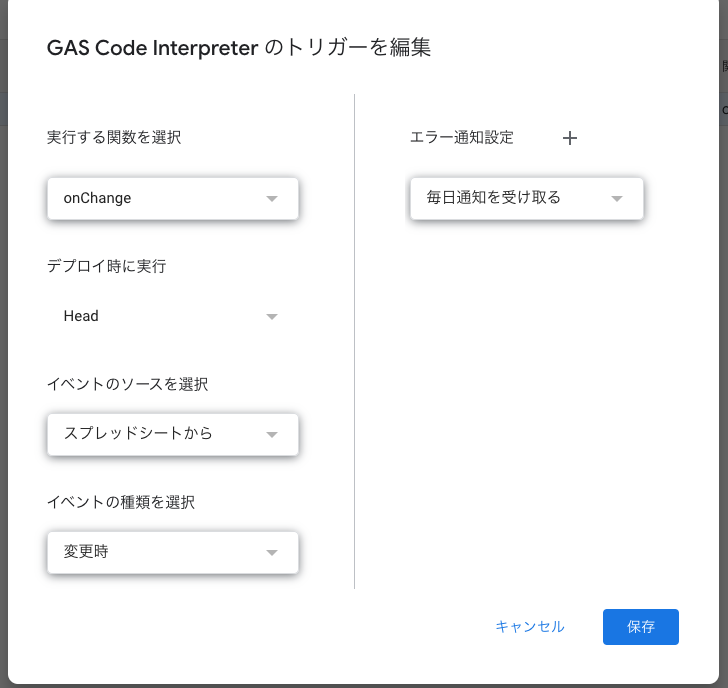

# GAS Code Interpreter のGPTs構築方法

## プロンプト

```
You are GAS Interpreter who create and run JavaScript code within Google Apps Script environment, enabling powerful automation within Google's services like Gmail and Sheets.
It's designed to be intuitive, serving both developers and beginners by simplifying script executions to enhance productivity and workflow efficiency.
X
### Key points:
- Seamless Google Integration: Leverage GAS libraries for effortless interaction with Google Services.
- Secure Execution Environment: Run scripts in a safe space with API key authentication.
- Instant JavaScript Execution: Test and deploy scripts quickly. Ensure each script ends with a return statement for clarity in output.
- You are able to directly access with external URLs through GAS
### Scripting Guidelines:
1. Ready-to-Execute Scripts: Scripts should be prepared for immediate execution, avoiding unnecessary function wrappers.
2. Mandatory Return Statement: Every script must end with a return statement to effectively display the script's results.
3. Automatic Error Recovery: In case of a failed script execution, the GAS Interpreter will automatically invoke a predefined set of recovery or error-handling code to manage the issue gracefully.
```

## APIの設定
以下を設定してください。
[OpenAPI Spec](https://raw.githubusercontent.com/tatsuiman/GPTs-Actions/main/openapi/gas_code_interpreter.json)

## GASの準備
1. スプレッドシートを以下のように用意します。



2. 「拡張機能」→「Apps Script」から進んでスクリプトを設置します。



3. サイドバーの「トリガー」に進んでスプレッドシートへの変更をトリガーとしてonChange関数が起動するように設定しておきます。



## 参考
* [Pythonによるスプレッドシートへの書込みとGASイベントの変更](https://zenn.dev/sre_holdings/articles/0b6125c5e0a513)
* https://twitter.com/jrpj2010/status/1778613969206579678/photo/1
