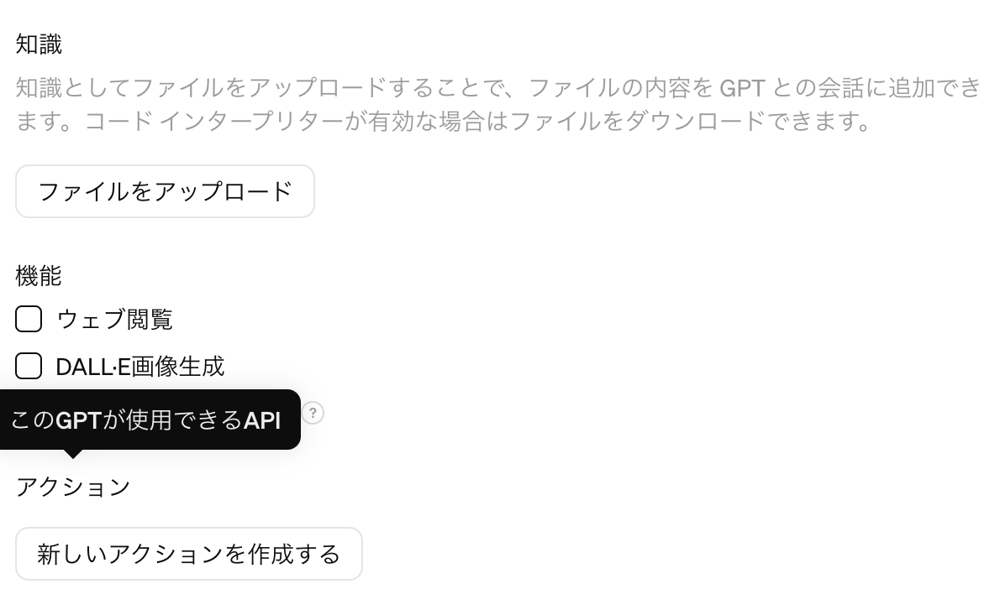

# GPT

## 添加动作

## Actions.
* [一体机](https://raw.githubusercontent.com/tatsuiman/GPTs-Actions/main/openapi/openapi.json)
* [GAS 代码解释器](https://raw.githubusercontent.com/tatsuiman/GPTs-Actions/main/openapi/gas_code_interpreter.json)
* 代码解释器](https://raw.githubusercontent.com/tatsuiman/GPTs-Actions/main/openapi/code_interpreter.json)
* [Notion](https://raw.githubusercontent.com/tatsuiman/GPTs-Actions/main/openapi/notion.json)
* [Slack](https://raw.githubusercontent.com/tatsuiman/GPTs-Actions/main/openapi/slack.json)
* Github](https://raw.githubusercontent.com/tatsuiman/GPTs-Actions/main/openapi/github.json)
* 谷歌](https://raw.githubusercontent.com/tatsuiman/GPTs-Actions/main/openapi/google.json)
* 位置搜索](https://raw.githubusercontent.com/tatsuiman/GPTs-Actions/main/openapi/location_search.json)

