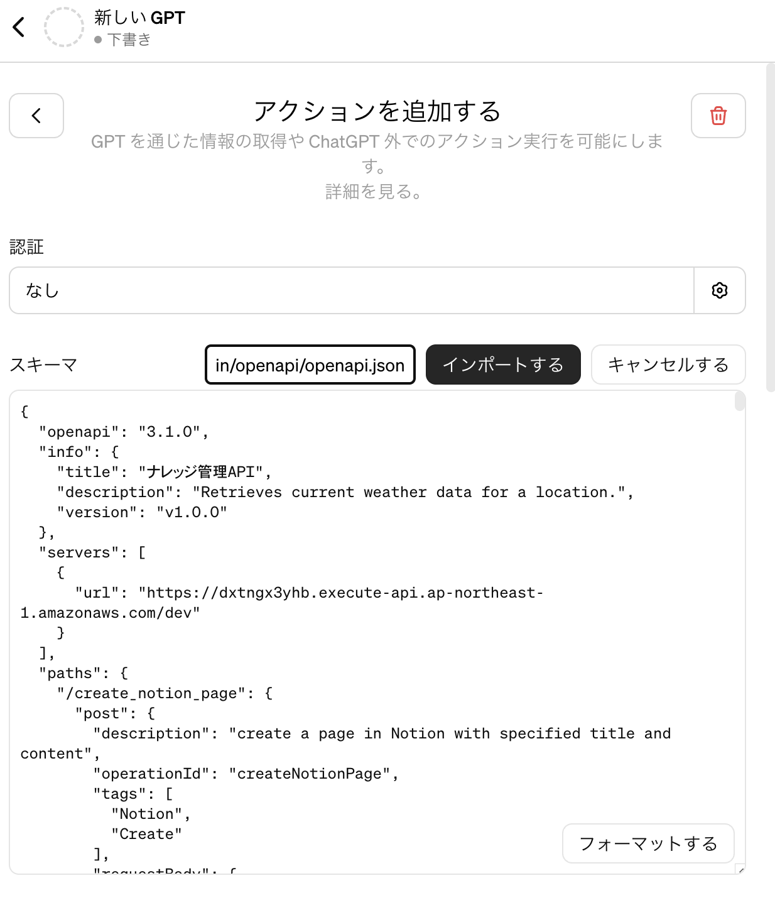
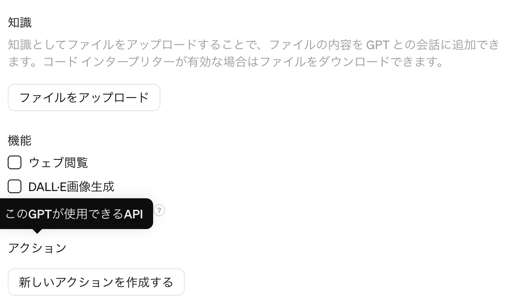

# GPTs 

## アクションを追加する

## アクションの一覧
* [All in one](https://raw.githubusercontent.com/tatsuiman/GPTs-Actions/main/openapi/openapi.json)
* [GAS Code Interpreter](https://raw.githubusercontent.com/tatsuiman/GPTs-Actions/main/openapi/gas_code_interpreter.json)
* [Code Interpreter](https://raw.githubusercontent.com/tatsuiman/GPTs-Actions/main/openapi/code_interpreter.json)
* [Notion](https://raw.githubusercontent.com/tatsuiman/GPTs-Actions/main/openapi/notion.json)
* [Slack](https://raw.githubusercontent.com/tatsuiman/GPTs-Actions/main/openapi/slack.json)
* [Github](https://raw.githubusercontent.com/tatsuiman/GPTs-Actions/main/openapi/github.json)
* [Google](https://raw.githubusercontent.com/tatsuiman/GPTs-Actions/main/openapi/google.json)
* [Location Search](https://raw.githubusercontent.com/tatsuiman/GPTs-Actions/main/openapi/location_search.json)

